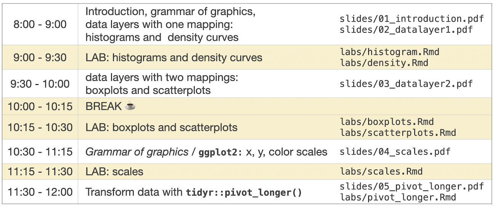
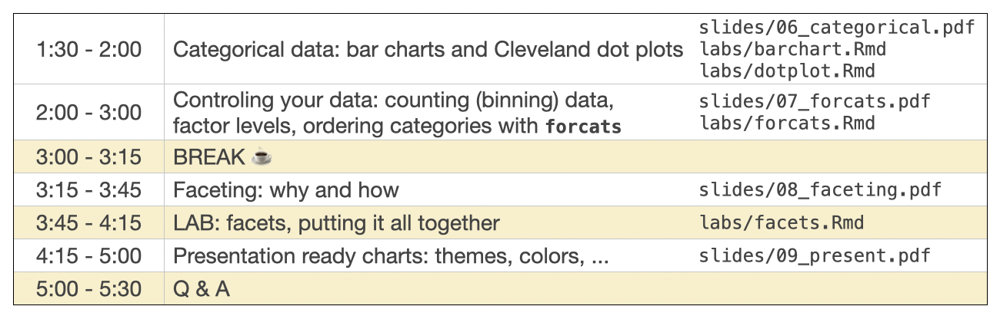

# Workshop materials for CSP 2024 short course

Workshop participants: It was a pleasure to teach you! Please feel free to reach out to me by email with any questions. 

## SC02: Effective Graphs with ggplot2

*Instructor: Joyce Robbins, Columbia University*

The morning half of the course is designed for complete beginners or those with some experience working with ggplot2 who want to solidify their knowledge and better understand the logic of this graphical package. We will start with the theoretical underpinnings of ggplot2 in Leland Wilkinson's grammar of graphics framework with the goal of increasing your ability to create graphs intuitively and with a better sense of what works and what doesn't. Next, we will cover best practices for graphing continuous data, namely histograms, boxplots, density curves, and scatterplots. We will wrap up the morning session with a discussion of data types and data transformation with tidyr. The afternoon part of the course will discuss best practices for categorical data, namely bar charts and Cleveland dot plots. Since knowing how to reorder factor levels is essential for creating effective graphs with categorical data, we will introduce a number of helpful functions from the forcats package. The second topic of the afternoon will be faceting, a powerful and underused tool for creating multiple panels that differ only by factor level. We will end the day with tips and tricks to make your graphs audience-ready, including the intentional use of color and theme elements.

https://ww2.amstat.org/meetings/csp/2024/courses.cfm

# Schedule

Morning schedule

Afternoon schedule

# Resources

[ggplot2 cheatsheet](https://rstudio.github.io/cheatsheets/data-visualization.pdf)

(or click "Help", "Cheat Sheets", "Data Visualization with ggplot2" in RStudio to download)

[Required aesthetic mappings](https://edav.info/learning-ggplot2.html#required-aesthetic-mappings)

[Colors in R](http://www.stat.columbia.edu/~tzheng/files/Rcolor.pdf)

